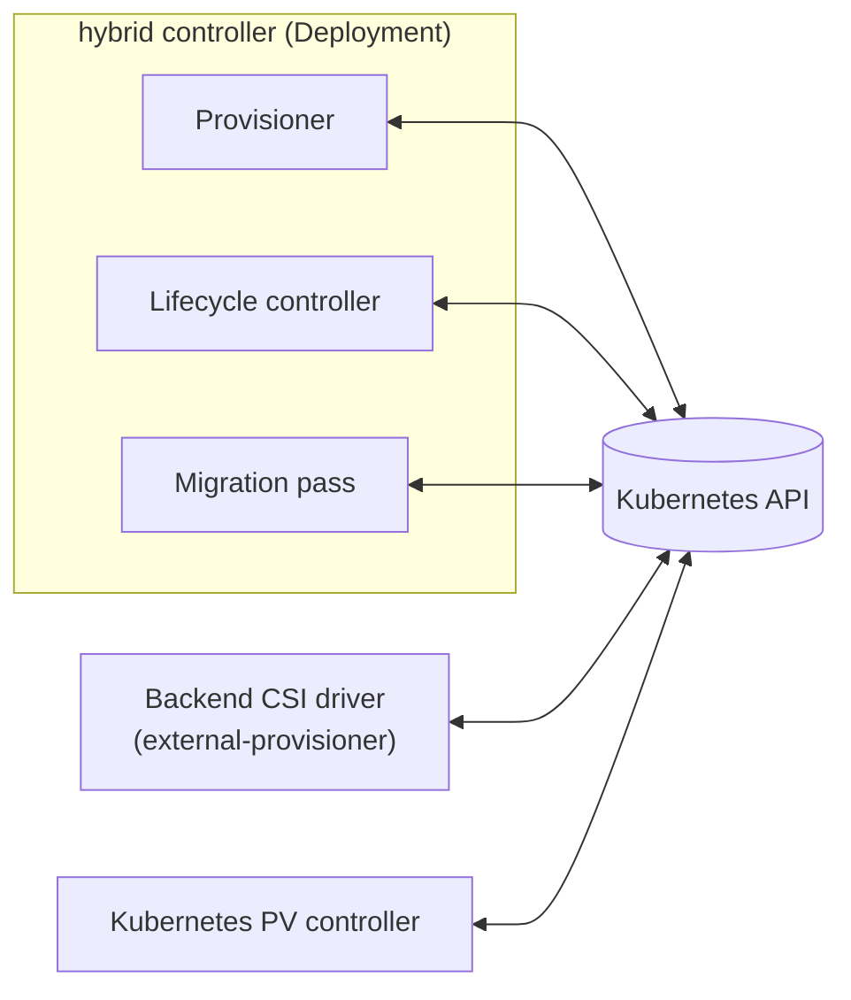
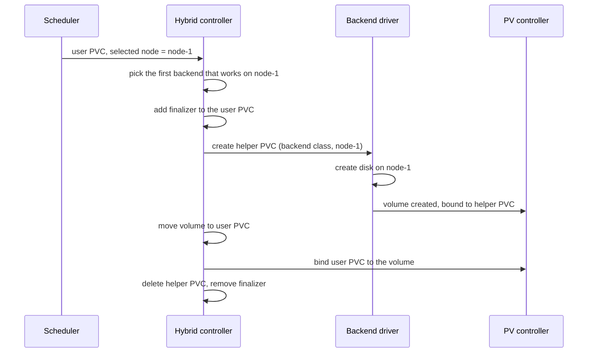

# Architecture

This document explains how the Hybrid CSI Plugin works: what it is made of, what happens when a volume is created, and how it keeps volumes safe when something goes wrong.

## The problem

A StatefulSet, and many operators, use one StorageClass for all their volumes. In a cluster with different groups of nodes, each group often has its own storage: for example Proxmox disks on one group and cloud volumes on another. No single StorageClass works on every node, so the StatefulSet cannot spread across the groups.

The plugin solves this with a **hybrid StorageClass**. It is a list of real StorageClasses, called **backends**. When a volume is needed on a node, the plugin picks a backend that works on that node, and lets that backend create the volume.

```yaml
apiVersion: storage.k8s.io/v1
kind: StorageClass
metadata:
  name: hybrid
provisioner: csi.hybrid.sinextra.dev
parameters:
  storageClasses: proxmox,hcloud-volumes
reclaimPolicy: Delete
volumeBindingMode: WaitForFirstConsumer
```

The plugin never stores data. It does not attach, mount, resize or delete disks. It only decides which backend creates a volume, and then gives that volume to the user's PVC.

## Words used in this document

| Word | Meaning |
|------|---------|
| **Hybrid StorageClass** | The StorageClass with `provisioner: csi.hybrid.sinextra.dev`. Users create their PVCs with it |
| **Backend** | A normal StorageClass from the `storageClasses` list, for example `proxmox`. Its own CSI driver creates the disks |
| **User PVC** | The PVC the user creates with the hybrid StorageClass |
| **Helper PVC** | A temporary PVC the plugin creates with the backend StorageClass. It is named `pvc-<uid of the user PVC>` and lives in the same namespace |
| **Volume** | The PersistentVolume the backend creates for the helper PVC. In the end it belongs to the user PVC |

## Components

The plugin is one controller, a single Deployment. It has no node plugin and no DaemonSet. It only talks to the Kubernetes API.



**Provisioner.** It is built on the standard Kubernetes provisioner library, which calls it for every user PVC of a hybrid StorageClass that waits for a volume. Each call looks at the current state, does the next step, and returns. It never blocks while it waits for the backend. The library calls it again later, with a growing delay (from 1 second up to 5 minutes by default).

**Lifecycle controller.** It watches PVCs and PersistentVolumes. It cleans up when a user PVC, a helper PVC or a whole namespace is deleted during provisioning. It also finishes work that the provisioner could not finish, for example after a crash.

**Migration pass.** It runs when the controller starts and then every 10 minutes. It adopts volumes created by old versions (v0.x) and reports things they left behind. See [Upgrade from v0.x](#upgrade-from-v0x).

When more than one replica runs, leader election makes sure only one of them is active.

## Creating a volume

The hybrid StorageClass uses `volumeBindingMode: WaitForFirstConsumer`. This means Kubernetes first schedules the pod, and only then asks for a volume, on the node the pod got. The node is written on the user PVC in the `volume.kubernetes.io/selected-node` annotation.



Step by step:

1. **Pick a backend.** The plugin goes through the `storageClasses` list in order and takes the first backend that works on the node. A backend works on a node when:
   - its StorageClass exists,
   - its `allowedTopologies`, if set, include the node,
   - its CSI driver is registered on the node (in the node's CSINode object). Backends that are not CSI drivers skip this check.

   The chosen backend is saved on the user PVC (`csi.hybrid.sinextra.dev/backend-class`). Later calls use the same backend, so the choice does not change halfway.

   If no backend works on the node, the PVC is **rescheduled**: the plugin removes the selected node, and the scheduler puts the pod on another node.

2. **Protect the user PVC.** Before it creates anything, the plugin adds the finalizer `csi.hybrid.sinextra.dev/provisioning` to the user PVC. From now on the user PVC cannot disappear before the plugin has cleaned up.

3. **Create the helper PVC.** It has the same size, access modes, volume mode and data source as the user PVC, the backend StorageClass, and the same selected node. It also has:
   - the finalizer `csi.hybrid.sinextra.dev/helper`,
   - the label `csi.hybrid.sinextra.dev/role=helper`,
   - the annotation `csi.hybrid.sinextra.dev/owner-uid` with the UID of the user PVC,
   - an owner reference to the user PVC.

4. **Wait for the backend.** The backend's own CSI driver sees a normal PVC and creates a disk for it, on the selected node. The plugin does not take part in this. While it waits, it copies Warning events of the helper PVC to the user PVC as `WaitingForBackend`, so the user can see the backend's errors.

5. **Check the volume.** When the helper PVC is bound, the plugin checks that the volume really fits the selected node. If it does not, the plugin deletes the helper PVC and reschedules.

6. **Move the volume** to the user PVC. This is one write to the PersistentVolume, which changes three things together:
   - the claim reference now points to the user PVC,
   - the reclaim policy is set from the hybrid StorageClass,
   - the plugin's labels and annotations are added.

   Because it is one write, there is no moment when the volume is free and another PVC could take it.

7. **Bind the user PVC** to the volume.

8. **Clean up.** The plugin deletes the helper PVC and removes the finalizer from the user PVC. The helper PVC is now "Lost" (its volume belongs to someone else), so deleting it does not delete the disk.

The volume keeps the backend's StorageClass name, the backend's CSI driver, and the `pv.kubernetes.io/provisioned-by` annotation of the backend. For Kubernetes it is a normal volume of the backend. This is why `kubectl get pv` shows the backend StorageClass, not the hybrid one.

## After the volume is created

The plugin's work ends with step 8. It keeps no finalizer on a bound PVC. Everything else is done by Kubernetes and the backend, as for any volume of that backend:

| Action | Done by |
|--------|---------|
| Attach and mount | The backend's CSI node plugin and attacher |
| Expansion | The backend's `external-resizer`. Kubernetes checks `allowVolumeExpansion` of the hybrid StorageClass, so it should be `true` only if every backend can expand |
| Snapshots | The snapshot controller, with a VolumeSnapshotClass of the backend's driver |
| Deletion | The backend's provisioner, following the reclaim policy the plugin set |

This also means bound volumes keep working when the plugin is stopped or uninstalled. The plugin is only needed to create new volumes.

## Why nothing leaks

Every step can run again and give the same result. Every call to the provisioner first reads the current state of the user PVC, the helper PVC and the volume, and then does only the next missing step. If the controller crashes at any point, the next call or the lifecycle controller continues from there.

Two finalizers make sure the plugin always gets a chance to clean up:

| Finalizer | On | Why |
|-----------|----|-----|
| `csi.hybrid.sinextra.dev/provisioning` | User PVC | Added before the helper PVC exists, removed after cleanup. If the user deletes the PVC halfway, the plugin still sees it and can delete the helper PVC and its fresh disk |
| `csi.hybrid.sinextra.dev/helper` | Helper PVC | If someone else deletes the helper PVC before the volume is moved, the plugin still sees it and can save or delete the volume correctly |

No finalizer is put on the volume. It changes owner in a single write, so it does not need one.

The plugin never touches a PVC that is not its own. A PVC with the helper name, but without the right `owner-uid`, is left alone.

### What happens when something is deleted

| Situation | What the plugin does |
|-----------|----------------------|
| User PVC deleted before the volume is moved | Deletes the helper PVC. Its fresh disk is deleted too, even if the backend StorageClass uses `Retain`, because nobody has used it yet |
| User PVC deleted after the volume is moved | Removes the finalizer. The volume follows the reclaim policy of the hybrid StorageClass |
| Namespace deleted during provisioning | The same as above, for every PVC in it. The namespace finishes deleting while the controller runs |
| Helper PVC deleted by someone else, not yet bound | Removes its finalizer. A new helper PVC is created on the next call |
| Helper PVC deleted by someone else, already bound | Moves the volume to the user PVC anyway, so the disk is not lost |
| Controller crashes in the middle | The next call continues from the last finished step. If the user PVC is already bound, the lifecycle controller finishes the cleanup after a short delay (30 seconds) |

If the controller is not running, PVCs and namespaces that are deleted during provisioning wait in `Terminating` until it starts again.

### Racing with Kubernetes

After the volume is moved to the user PVC, the Kubernetes PV controller may bind the user PVC by itself, before the plugin does it in step 7. The plugin then gets a conflict error. It reads the user PVC again, sees that it is already bound to the right volume, adds its missing annotations, and continues with the cleanup in the same call.

## Rescheduling

Sometimes the chosen node cannot get a volume. The plugin then asks Kubernetes to schedule the pod again, so it can land on another node. This is called **rescheduling**: the plugin removes the selected node from the user PVC, and the scheduler picks a node again.

The plugin reschedules when:

- **no backend works on the node**,
- **the backend is too slow**: the helper PVC is still pending after `--helper-timeout` (default `10m`). For example, the backend is broken on that node,
- **the backend rejects the node**: it removes the selected node from the helper PVC, for example when the node is out of space. The plugin does not wait for the timeout,
- **the volume does not fit the node**: the backend created it somewhere else.

In the last three cases a helper PVC already exists. The plugin also deletes it, forgets the chosen backend, and counts the reschedule in the `csi.hybrid.sinextra.dev/reschedules` annotation.

A PVC is rescheduled at most `--helper-max-reschedules` times (default `3`) for these reasons. After that, the plugin stops rescheduling, emits `HelperTimeout`, `BackendRejected` or `VolumeNodeMismatch` events, and keeps waiting. This avoids moving a pod around the cluster forever.

## Metadata

The plugin keeps all its state in labels and annotations on normal Kubernetes objects. It has no CRDs and no database.

On the **user PVC**, during provisioning:

| Key | Meaning |
|-----|---------|
| `csi.hybrid.sinextra.dev/backend-class` | The chosen backend StorageClass |
| `csi.hybrid.sinextra.dev/helper` | Name of the helper PVC, to help debugging |
| `csi.hybrid.sinextra.dev/reschedules` | How many times the PVC was rescheduled |

On the **helper PVC**:

| Key | Meaning |
|-----|---------|
| label `csi.hybrid.sinextra.dev/role=helper` | Finds every helper PVC with one label selector |
| `csi.hybrid.sinextra.dev/owner-uid` | UID of the user PVC. Without it, the PVC is not the plugin's |
| `volume.kubernetes.io/selected-node` | The node, so the backend creates the disk in the right place |

On the **volume**:

| Key | Meaning |
|-----|---------|
| label `csi.hybrid.sinextra.dev/managed=true` | The volume was created through the plugin |
| `csi.hybrid.sinextra.dev/claim` | `namespace/name` of the user PVC |
| `csi.hybrid.sinextra.dev/storage-class` | Name of the hybrid StorageClass |
| `csi.hybrid.sinextra.dev/migrated` | The volume was created by v0.x and adopted later |
| `csi.hybrid.sinextra.dev/reclaim-policy-checked` | The reclaim policy of a migrated volume was checked once and is not checked again |

## Upgrade from v0.x

Old versions created volumes in a different way and could leave things behind after a crash. The migration pass handles them. It changes no data. It only adds metadata and reports problems:

- **Volumes of v0.x** get the `managed` label and the `migrated` annotation.
- **Wrong reclaim policy.** v0.x could leave a volume with `Retain` when the hybrid StorageClass says `Delete`. The plugin reports this with a `ReclaimPolicyMismatch` event. It fixes the policy only when the operator enables `--fix-reclaim-policy`, and only once per volume. Later changes by an admin are kept.
- **Leaked volumes and helper PVCs** get `OrphanedVolume` and `OrphanedHelper` events. They are never deleted automatically, because the plugin cannot prove they are its own.
- **Helper PVCs of v0.x** that are still in use are adopted, so their provisioning finishes.
- **Helper pods** of the old `pod` method are deleted when they are not needed any more.

## Seeing what happens

**Events** on the user PVC tell its story: `BackendSelected` when the helper PVC is created, `WaitingForBackend` for backend errors, `Rescheduled` with the reason, and `ProvisioningSucceeded` at the end. The helper PVC's own events show what the backend is doing.

**Metrics** count the provisioning steps and their errors, the reschedules and their reasons, the helper PVCs that exist now, and how long backends take. The migration pass reports what it found as gauges. The full list is in [metrics.md](metrics.md).

## Limitations

- The hybrid StorageClass must use `WaitForFirstConsumer`. The backend is chosen for the node, so the node must be known first.
- During provisioning, the namespace has two PVCs for one volume: the user PVC and the helper PVC. Both count against ResourceQuota. See [ResourceQuota](install.md#resourcequota).
- For restore and clone, the data source is passed to the backend, but the backend is still chosen by the node only, not by the driver of the snapshot or the source PVC. If the chosen backend cannot use the source, it fails, and the PVC is rescheduled after the helper timeout. Restore or clone across backends is not supported.
- Expansion works only if the backend supports it. Non-CSI backends, like local-path, cannot expand.
